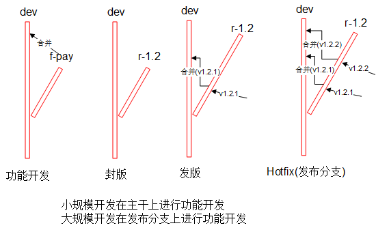

# 主流版本模型
* 原则：新分支只能合并到来源分支(不能在新分支之间做合并)，来源分支可以将部分改进合并到新分支
* 资料：[分支模型](http://blog.csdn.net/qq_34651940/article/details/51891767)，[英文原版](http://nvie.com/posts/a-successful-git-branching-model/)。master上可能会发生多个版本混合事情【世界是个树，不是线】，不建议用master


|分支类型 | 名称 | 永久 | 命名规范 | 来源 | 操作 | 合并到 | 角色 |
| -------- | ----- | ----- | ----- | ---- |----- | ----- | ---- |
| master | 主干，正式环境 | Y | master | release，hotfix | 无 | 无 | 发布人员 |
| develop  | 开发分支，开发环境，测试环境 | Y |  dev | 无 | 任意 | 无 | 开发人员 |
| feature | 功能分支 | N |  f-pay。f-功能说明 | dev | 任意 | dev | 开发人员 |
| release | 版本发布分支 | N | r-2.3。r-版本号 | dev | bugfix | dev | 发布人员，开发人员 |
| hotfix | 补丁分支 | N | h-332452。h-bug说明 | master | bugfix | dev | 发布人员，开发人员 |

# 最佳实践
## 原则
1. 未经测试或代码审核的，不准发生产环境
1. 构建必须基于tag
1. 除了开发环境，其他都必须是tag

### 分支tag命名规范
| 类型 | 格式 | 示例 | 说明 |
| :-: | - | - | - |
| 主干/开发分支 | dev | dev | 默认 |
| 功能分支 | f-功能说明 | f-pay |  |
| 发布分支 | r-版本 | r-4.0 | 2位，3位会有大量合并要做 |
| hotfix分支 | h-jira号 | h-123 |  |
| 发布tag | v版本 | v4.0.1 | 3位 |

## 工作流程


| 项 | 步骤 | 说明 |
| :-: | - | - |
| 封版 | 1. 新开发布分支 | 基于主干分支 |
| 发版 | 1. 打发布tag<br>2. 分支合并回主干<br>3. 基于发布tag构建包 | 基于发布分支 |
| hotfix | 1. fix：二选一，推荐1.1<br>1.1. 发布分支fix<br>1.2. hotfix分支fix<br>1.2.1. 基于发布分支新开hotfix分支<br>1.2.2. fix后hotfix分支合回发布分支<br>2. “发版” | 有多个hotfix版本情况下，非最新hotfix版本出问题的处理方案：hotfix后打成最新的tag。<br>比如：v1.2.1上hotfix后打tag成v1.2.9 |


## 环境清单
1. 每个环境都有独立的一套：执行程序，数据库，配置

| 环境 | 分支tag | 说明 |
| :----: | ---- | ---- |
| 开发环境 | 开发分支 | 开发人员自行搭建环境 |
| 测试环境 | 发布分支 |  |
| 正式环境 | 发布tag |  |

# git
## 流程
### 初始化
1. 从master克隆dev：git checkout master; git branch dev;

### 开发feature分支
1. 从dev克隆feature：git checkout dev; git branch V2.3_ft_pay_lyx;
1. 开发人员检出：git checkout V2.3_ft_pay_lyx;
1. feature合并回dev：git checkout dev; git merge V2.3_ft_pay_lyx;

### 开发release分支
1. 从dev克隆release：git checkout dev; git branch V2.3_rl_20161111;
1. 开发人员检出：git checkout V2.3_rl_20161111;
1. release合并回dev：
1. release合并到master（是一个发布版本。同时需要打标签）：

### 开发hotfix分支
1. 从master克隆hotfix：git checkout master; git branch V2.2_hf_123456-332452_wyq;
1. 开发人员检出：git checkout V2.2_hf_123456-332452_wyq;
1. hotfix合并回master：
1. hotfix合并到dev/release：

> hotfix时，当有一个release分支同时存在（当前版本快发布了，却发现上个版本的bug）。这个hotfix分支必须被合并到release分支而不是dev分支(release后续会合并到dev)。

### 部署环境
1. 获取代码(测试环境)：git -C DIR checkout dev; git -C DIR pull;
1. 部署

## 命令脚本
### branch
1. git clone URL 目录 // 下载到指定目录，默认是仓库名。默认分支是master
1. git clone --depth 1 URL // 克隆最后一次commit。加快速度，会有信息吗？
1. git clone -b master --single-branch URL // 克隆指定的版本。加快速度，非本分支信息缺失
1. 显示当前分支：git branch
1. 显示所有分支，含远程分支：git branch -va
1. 显示分支的提交记录：git show-branch
1. 显示当前分支的版本号(commit id)：git rev-parse HEAD
1. 切换分支/标签
  1. 切换本地分支：git checkout 分支/tag/commit，git checkout branch1, git checkout tag1, git checkout commit1
  1. 下载远程分支并切换【下载前先git pull同步】：git checkout -b <本地分支> origin/<远程分支>，git checkout -b lb origin/rb
  1. 下载远程标签并切换【下载前先git pull同步】：git checkout -b <本地分支> origin/<远程tag>
1. 基于当前分支创建新分支/切换分支：git branch <分支>
1. 删除分支：git branch -d <远程分支>

### commit
1. [add命令](https://www.yiibai.com/git/git_add.html)
1. git add -f . && git commit -m "msg" && git push // 快速提交
1. git checkout -b abc && git push origin abc:abc // 本地创建分支并推送到远程同名分支
1. 添加所有的文件，包括删除的[所有跟踪文件中被修改过或已删除文件,所有未跟踪的文件]：git add -A .
1. 查看所有的commit提交记录：git log
1. 查看所有的commit提交记录(含文件清单)：git log --name-status
1. 查看最新的commit：git show
1. 查看指定commit的所有修改：git show commitSHA
1. 查看某次commit中具体某个文件的修改：git show commitSHA fileName

### 其他
1. git fetch && git reset --hard @{upstream} && git clean -ffdx // [重置目录到服务器状态](https://bitmingw.com/2018/01/28/git-branch-factory-reset/)
1. git status // 显示当前目录的文件情况
1. git blame file_path // 显示文件内容的具体修改情况
1. git cat-file -p commitid // 显示提交号的具体内容
1. **指定在特定目录执行git：git -C <目录> 执行命令**
1. 拉取当前分支：git pull
1. 拉取分支：git pull <远程主机> <远程分支>:<本地分支>，git pull origin master:master
1. 合并分支(远程分支合并到当前分支)：git merge <远程分支>
1. 清除当前目录所有commit冲突的文件，不会回退：git reset hard
1. git reset .
1. 清除当前目录下所有没commit的管理文件的修改：git checkout .
1. 清除当前目录下所有非管理文件：git -C . clean -xdf
1. [Git查看和修改账户](https://blog.csdn.net/junloin/article/details/75197880), git config

## 操作
### 选择提交的分支
按照以下顺序选择：
1. release分支：bugfix(无bugfix分支的情况下)，需尽快发布的小改动和功能
1. dev分支：
  * 下个版本 && 小改动
  * 下个版本 && (新增功能 && 不修改原有逻辑)
1. feature分支：到了测试和发布阶段再合并回dev分支
  * !下个版本
  * 下个版本 && 调整功能
  * 下个版本 && (新增功能 && 修改原有逻辑)

### 暂存文件
* 工作区代码暂存，会记录来源分支
* 使用场景：有新工作要做（如bugfix）+ 当前工作区有不少修改了却无法提交的文件
* 暂存当前工作区，切换到新工作，恢复当前工作区

### 打补丁
* 跨分支代码迁移
* 使用场景：提交了代码到主分支+该功能代码需要先发布上线
* 在主分支上选择该功能对应的所有提交，创建成一个补丁，在发布分支上应用本补丁

### 取消本地已提交但没远程推送的记录
1. 重置到commit前的上一个版本，常用mixed
  * soft：提交内容放在缓冲区(相当于git add了)
  * mixed：提交内容不放在缓冲区(相当于改动后什么都没操作，git add后等于soft)
  * hard：丢弃提交内容

### pull时冲突处理
#### 无commit(2种方法，推荐暂存)
##### 暂存处理
1. stash暂存改动
1. pull最新的版本
1. stash pop，手动解决冲突

##### 冲突处理
1. commit
1. “有commit”的流程

#### 有commit
1. pull，手工解决冲突
1. commit(解决冲突)merge版本
1. push

#### 冲突各方说明

| 方式 | 我的(LOCAL) | 他人(REMOTE) |
| :----: | ---- | ---- |
| 使用暂存 | 本地文件 | 暂存 |
| 分支A合并到分支B | B | A |
| 使用补丁 | 本地文件 | 补丁 |

### 代码合并

| 方式 | 说明 |
| :----: | ---- |
| 分支merge |  |
| [cherry-pick](https://www.ruanyifeng.com/blog/2020/04/git-cherry-pick.html) | 指定commit列表 |
| [打补丁](https://my.oschina.net/sdlvzg/blog/1608861) | 指定文件列表或指定commit列表 |

* [Git - 分支的新建与合并](https://git-scm.com/book/zh/v2/Git-%E5%88%86%E6%94%AF-%E5%88%86%E6%94%AF%E7%9A%84%E6%96%B0%E5%BB%BA%E4%B8%8E%E5%90%88%E5%B9%B6)
* [Git – Fast Forward 和 no fast foward](https://my.oschina.net/yuzn/blog/82297)
* [多个commit合并成1个commit](https://segmentfault.com/a/1190000007748862)
* [冲突文件说明](https://blog.csdn.net/zhangbinsijifeng/article/details/49332615)
```
BASE是双方的父亲

<<<<<<< HEAD
我的
=======
他人
>>>>>>>6853e5ff961e684d3a6c02d4d06183b5ff330dcc
```
* 取消合并: git merge --abort

### 变基(rebase)
* merge和rebase的最终结果没有任何区别
* https://xiaozhuanlan.com/topic/6873210549
* https://git-scm.com/book/zh/v2/Git-%E5%88%86%E6%94%AF-%E5%8F%98%E5%9F%BA
* https://blog.csdn.net/kuangdacaikuang/article/details/79619828

| 方式 | 说明 | 优点 | 缺点 |
| :----: | ---- | ---- | ---- |
| merge | 合并时遇到冲突，修改后重新commit | 记录commit的实际情况，方便查看 | 无改动会快进合并，否则自动创建一个新的merge commit |
| rebase | 将commit历史进行合并，并行变串行。本质是补丁模式 | 提交历史更加整洁 | 发生冲突时不容易定位问题，因为rewrite了history |

### 仓库迁移
* https://help.github.com/cn/articles/duplicating-a-repository

### 重置目录
* "git -C src fetch && git -C src reset --hard && git -C src checkout B1 && git -C src pull"
* src是git目录路径，B1是分支或者标签。如是标签pull会失败，可忽略

### 信息获取
* git -C $3 symbolic-ref --short -q HEAD // 分支
* git -C $3 describe --always --tag // 标签
* git -C $3 rev-parse --short HEAD // 提交

### 清除已删除的文件(其存在于历史提交中)
[寻找并删除Git记录中的大文件](https://harttle.land/2016/03/22/purge-large-files-in-gitrepo.html)
```
// 下载全部分支
git clone --bare <git_url>
// 获取前十个最大的文件
git rev-list --objects --all | grep "$(git verify-pack -v .git/objects/pack/*.idx | sort -k 3 -n | tail -10 | awk '{print$1}')"
// 将文件名存入large_files.txt，基于文件清除
git filter-branch -f --prune-empty --index-filter "git rm -rf --cached --ignore-unmatch `cat large_files.txt`" --tag-name-filter cat -- --all
// 如果文件所在目录删除了，就无法清除文件了，只能清除目录
git filter-branch -f --prune-empty --index-filter 'git rm -rf --cached --ignore-unmatch 相对目录' --tag-name-filter cat -- --all
// 提交到远程仓库
git push origin --all -f
```

### 提交失败相关处理
```
设置大缓存，用于大文件提交失败：git config --global http.postBuffer 52428000
显示命令的详细信息，用于提交失败原因定位：export GIT_CURL_VERBOSE=1
显示所有配置：git config -l
```

### 统计
1. 统计工具：cloc, git_stats
1. [统计脚本](https://blog.csdn.net/weixin_34277853/article/details/89700887)
```
echo "统计结果:" && git log --first-parent master --author="andrew" --after="2018-09-16 12:00:00" --before="2019-09-16 00:00:01" --pretty=tformat: --numstat | gawk '{ add += $1 ; subs += $2 ; loc += $1 - $2 } END { printf "增加行数:%s 删除行数:%s 变化总行数:%s\n",add,subs,loc }'
echo "详情如下:" && git log --first-parent master --author="andrew" --word-diff --since="2019-05-16 00:00:01" --until="2019-09-16 12:00:00" -p --stat
```

### 同一台电脑上的仓库目录用不同账号提交
1. 相同或不同仓库都可以
1. 操作如下，核心是设置仓库实例的git账号信息
```
cd 仓库目录
git config --local user.name NAME
git config --local user.email EMAIL@email.com
```

### 下载部分文件
* 只能生效一次，再做需要重头操作
* 支持多层目录
```
git init && git config core.sparseCheckout true && echo "design/" >> .git/info/sparse-checkout
git remote add -f origin url && git pull origin master
```

### 强制删除远程分支上的某次提交
1. [强制删除远程分支上的某次提交](http://blog.csdn.net/qqxiaoqiang1573/article/details/68074847)
```
git reset --hard HEAD~1
git push origin master -f
```

### 重置branch
* [重置branch](https://blog.csdn.net/weixin_33974433/article/details/87963137)
* 结果是重建分支，一般用于master。其他分支直接删除即可。
```
思路：用空分支替换需重置的branch(master)
步骤：
git clone并进入目录
git checkout --orphan new_branch && rm * -rf // 创建孤儿空分支，清空
echo linux > README.md && git add -A && git commit -am "Initial commit" // 空分支加一个文件，没有文件无法创建commit，就没法替换master
git branch -D master && git branch -m master && git push -f origin master // 删除master，将空分支提交到master
```

### git 免除账号密码的设置
* [git 免除账号密码的设置](http://blog.csdn.net/guang11cheng/article/details/50537759)
* git config --global credential.helper store // 记住账号密码
* rm ~/.git-credentials // 取消账号密码记忆

1. 忽略SSL证书：git config --global http.emptyAuth true

### git和编辑器的LF设置
```
// atom
Settings -> Packages -> Line Ending Selector -> change the “Default line ending” setting to “LF” instead of “OS Default”.
// Git : https://blog.csdn.net/weixin_33859665/article/details/93834202
git config --global core.autocrlf false
git config --global core.safecrlf true
```

### gitlfs
1. [安装详见gitlab](./soft/dev/gitlab)
1. gitlfs安装后默认git clone是下载lfs文件的
1. 不下载lfs文件 配置: git config --global filter.lfs.smudge "git-lfs smudge --skip"
1. 下载lfs文件 配置: git config --global filter.lfs.smudge "git-lfs smudge -- %f"

## 资料
### 参考
1. [Learn Git Branching](https://learngitbranching.js.org/)，很好的示范
1. [猴子都能懂的GIT入门](https://backlog.com/git-tutorial/cn/intro/intro5_2.html)
1. **[git push & git pull 推送/拉取分支](http://blog.csdn.net/litianze99/article/details/52452521)**
1. [git – 简易指南](http://www.bootcss.com/p/git-guide/)
1. [Git下的冲突解决](http://www.cnblogs.com/sinojelly/archive/2011/08/07/2130172.html)
1. [git多账号提交适配](https://www.jianshu.com/p/d696b5fef750)
1. [git中detached HEAD、amend、rebase和reset](https://cloud.tencent.com/developer/article/1446002)
1. [Detached HEAD](https://zhuanlan.zhihu.com/p/66460426)
1. 分支整体图用TortoiseGit的[Reversion Graph](https://blog.csdn.net/zh_ITRoad/article/details/84857531)

### 账号
1. git账号：通过邮箱区分
  1. author：作者，通过commit命令添加
  1. committer：提交者，通过配置添加
    1. 全局配置: /user/NAME/.gitconfig
1. 服务商账号：服务商自定义，比如github账号密码

### 提交
1. github提交时不会检查服务商账号是否和git的committer一致，所以只要有github仓库权限就可以伪造成其他人的提交
1. github仓库首次输入会记忆

### 安装
1. [centos7编译安装](http://blog.csdn.net/chrislyl/article/details/70876682)，[参考2](http://blog.csdn.net/zongyinhu/article/details/54695404)
  * 脚本

```
// 依赖库
yum -y install autoconf

yum install curl-devel expat-devel gettext-devel openssl-devel zlib-devel  -y #以下四行是：安装git的依赖包
yum install curl libcurl4-openssl-dev perl cpio expat asciidoc docbook2x -y
yum install cpan -y
yum install perl-ExtUtils-CBuilder perl-ExtUtils-MakeMaker -y

// 下载
wget https://www.kernel.org/pub/software/scm/git/git-2.9.3.tar.gz
tar zxvf git-2.9.3.tar.gz
cd git-2.9.3

// 安装
autoconf
./configure
make
make install
```
